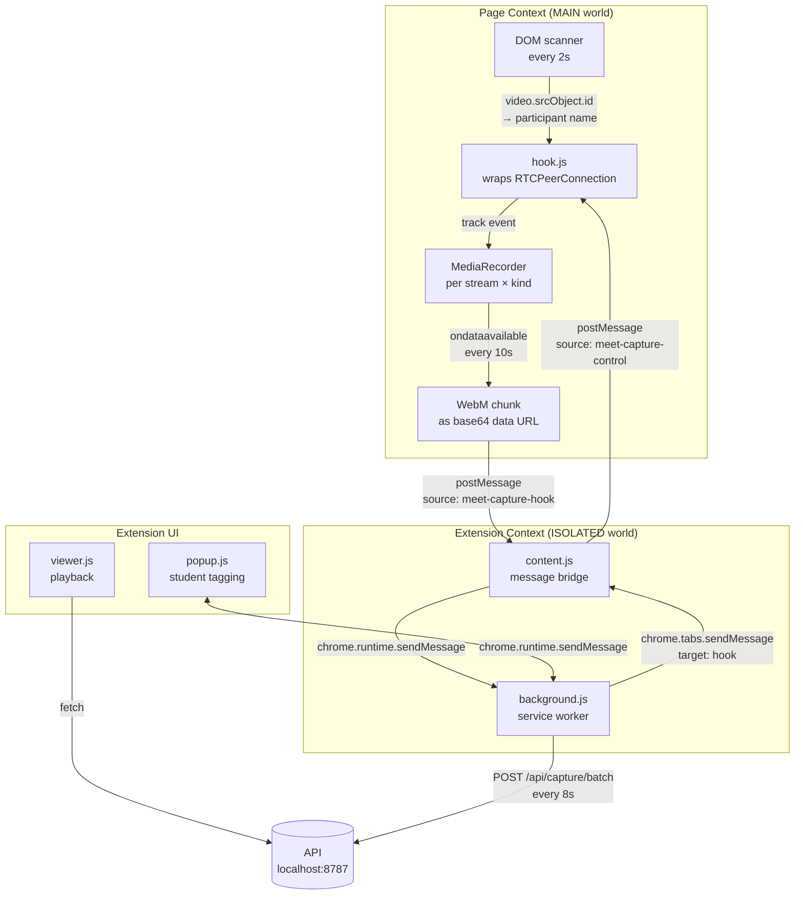
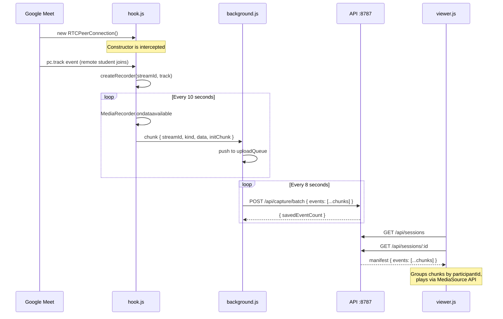
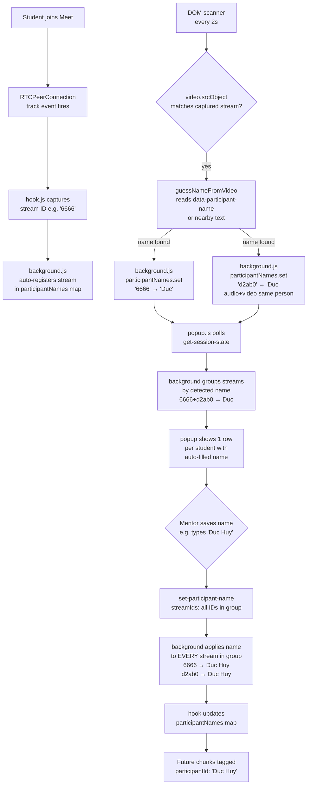
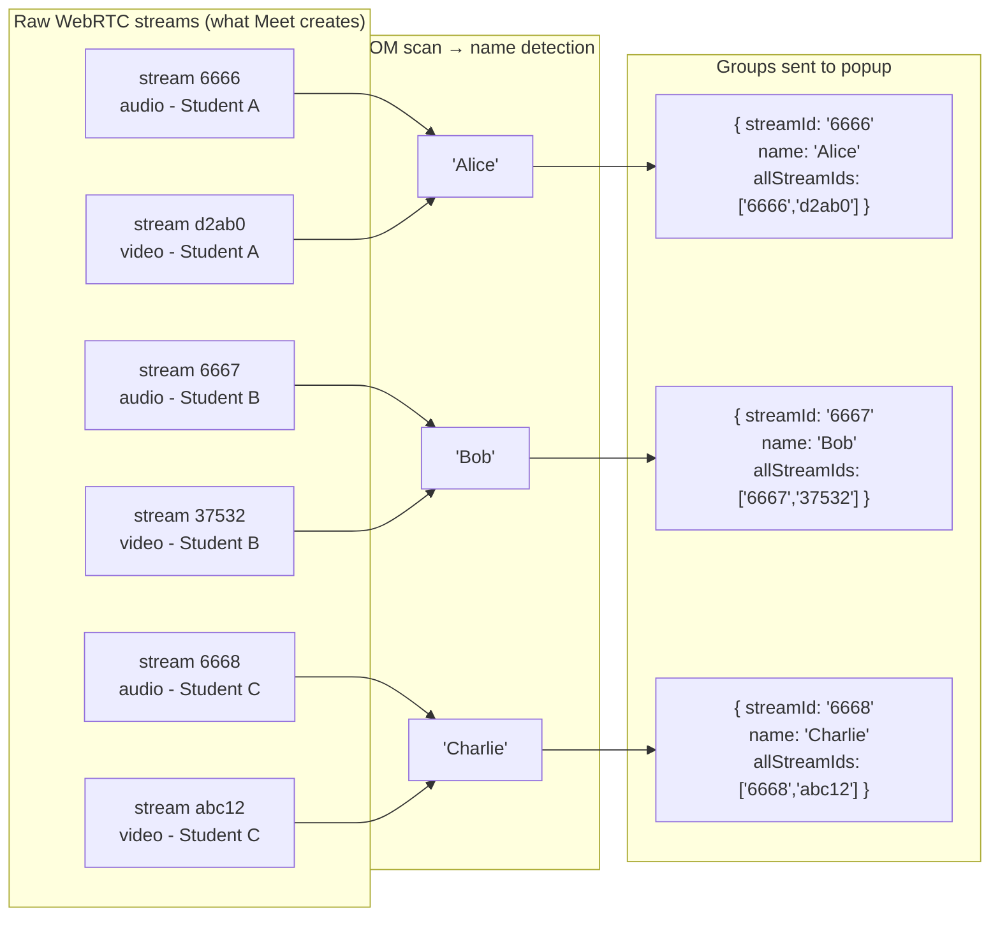

# Meet Capture - Mentor (v2)

A Chrome extension that captures per-student audio and video from Google Meet calls (mentor-side) and uploads them to a local API for playback.

## Architecture Overview



## Data Flow: Capture to Playback



## Student Tagging Flow



## Multi-Student Grouping



## File Structure

| File | World | Purpose |
|------|-------|---------|
| `hook.js` | MAIN | Wraps RTCPeerConnection, creates MediaRecorder per track, scans DOM for participant names |
| `content.js` | ISOLATED | Pure message bridge between hook.js and background.js |
| `background.js` | Service Worker | Session state, participant grouping, batch upload every 8s |
| `popup.html/js/css` | Extension UI | Student tagging, meeting status, upload controls |
| `viewer.html/js/css` | Extension Page | Per-student audio/video playback via MediaSource API |
| `manifest.json` | — | MV3 config: permissions, content script injection rules |

## Setup

### 1. Start the API

```bash
cd /home/huy/workspace/teencare/meet-capture-api
npm start
# Verify: curl http://localhost:8787/health
```

### 2. Load the extension

1. Open `chrome://extensions/`
2. Enable **Developer mode** (top right toggle)
3. Click **Load unpacked** → select `extension-webcam-v2/`

### 3. Record a session

1. Join a Google Meet call
2. Click the extension icon → enter your name (mentor label)
3. Students appear automatically as they join — names are auto-filled from Meet's DOM within 2 seconds
4. Correct any auto-detected names, then click ✓ to confirm
5. Record for 30+ seconds (chunks upload every 8s automatically)
6. Click **Open Viewer** to play back per-student audio/video

## How Recording Works

### RTCPeerConnection interception

`hook.js` runs before any page script (`document_start`, `world: "MAIN"`). It wraps `window.RTCPeerConnection` so every connection Meet creates passes through our code. On each `track` event we create a `MediaRecorder` for that track's `MediaStream`:

- One recorder per `(streamId, kind)` — never duplicates
- Records in 10-second chunks (`recorder.start(10000)`)
- First chunk flagged `initChunk: true` — contains WebM headers required for decoding
- Each chunk encoded as base64 data URL and posted to background

### Participant name detection

Every 2 seconds, `hook.js` scans all `<video>` elements whose `srcObject` matches a captured stream. It walks up the DOM from each video to find a participant tile, then reads `data-participant-name`, `data-self-name`, or nearby text — the same attributes Meet uses to label participant tiles. Noise words (`pin`, `mute`, `mic_off`, icon ligatures) are stripped.

### Stream grouping

A single student in Meet produces multiple `MediaStream` objects — typically one for audio and one for video. The grouping logic in `background.js` uses the auto-detected name as the key: if streams 6666 and d2ab0 both resolve to "Alice", they are grouped into one popup row with `allStreamIds: ['6666', 'd2ab0']`. Saving a name applies it to every stream in the group, so all chunks (audio + video) share the same `participantId` tag.

### Upload batch format

```json
{
  "meetingId": "abc-def-ghi",
  "sessionId": "session-2026-05-12T10-00-00-000Z-tab-123",
  "captureRole": "mentor",
  "mentorLabel": "Teacher Huong",
  "capturedParticipants": [
    { "participantKey": "Alice", "participantName": "Alice" }
  ],
  "events": [
    {
      "type": "chunk",
      "at": 1234567890,
      "payload": {
        "streamId": "6666",
        "participantId": "Alice",
        "kind": "audio",
        "data": "data:audio/webm;codecs=opus;base64,...",
        "initChunk": true,
        "index": 0
      }
    }
  ]
}
```

### Playback

The viewer fetches the session manifest from the API. Each `chunk` event has its WebM data inline (`metadata.data`). The viewer groups chunks by `participantId`, sorts by timestamp, and feeds them into a `MediaSource` + `SourceBuffer` — the browser decodes and plays a continuous stream.

## Debugging

**Background logs** — `chrome://extensions` → this extension → "Inspect views: service worker"

**Hook logs** — F12 on the Meet tab → Console (look for `[Hook]` prefix)

**Check API**
```bash
curl http://localhost:8787/api/sessions | jq '.sessions[0]'
```

## Known Limitations

- **Audio mixing** — Meet may send per-participant audio tracks or a single SFU-mixed track. If mixed, you get combined audio for all students.
- **DOM detection fragility** — name detection relies on Meet's DOM attributes; a Meet UI update can break auto-naming (manual fallback always works).
- **Chunk continuity** — MediaRecorder chunks are not individually seekable; the viewer must always prepend the init chunk before playing non-init chunks.

## Handoff Plan: Stable Student Ownership Across Stream Changes

### Problem summary

Google Meet can create a new `streamId` / track when:

- mentor switches tab
- Meet refreshes or rebinds a remote video track
- a student leaves or reconnects

That means raw `streamId` is **not** a stable student identity. Today we can often re-attach the new stream back to the correct student by DOM name + manual hints, but it is still best-effort. This is why the backend summary can still show extra UUID-like student cards with `0 chunks`.

### Goal

Introduce a stable, extension-owned student identity layer:

- `streamId`: transient technical ID from Meet
- `ownerId`: stable ID created by the extension for one student during one session

All future video chunks should be grouped by `ownerId`, not by raw `streamId`.

### Target design

When mentor names a student:

- create or reuse an `ownerId` such as `student-1`
- store:
  - `ownerId -> participantName`
  - `streamId -> ownerId`

When Meet later creates a replacement video stream:

- if DOM detection / manual tile hint says it belongs to `Huy Tablet`
- and `Huy Tablet` is already bound to `ownerId = student-1`
- map the new `streamId` to `student-1`

Then every uploaded chunk should include:

- `streamId`
- `ownerId`
- `participantId` or `participantName`

### Why this is the right next step

This separates:

- unstable WebRTC transport identity
- stable student ownership inside the extension

So even if Meet keeps changing stream IDs after tab switch, the backend and viewer still know the chunk belongs to the same student.

### Files to change next

#### `background.js`

Add stable ownership state:

- `ownerRecords: Map<ownerId, { ownerId, name, streamIds, createdAt, updatedAt }>`
- `streamToOwnerId: Map<streamId, ownerId>`
- helper:
  - `createOwner(name)`
  - `assignOwnerToStreams(ownerId, streamIds)`
  - `findOwnerByName(name)`

Change manual save flow:

- when mentor saves `"Huy Tablet"`
- create or reuse one `ownerId`
- assign all candidate stream IDs to that owner

Change auto-attach flow:

- when a new student-video stream appears
- if detected name matches an already saved student
- attach this new stream to that same `ownerId`

Important:

- tag-join candidate calculation should ignore any new stream that is already attached to an existing `ownerId`

#### `hook.js`

Keep current behavior, but allow control messages to carry owner context if needed later.

Optional next step:

- when `set-participant-name` is sent from background
- also cache a stable `ownerId` in hook-side maps for debugging / future chunk metadata

#### `meet-capture-api/src/server.js`

Extend saved chunk metadata to include `ownerId`.

Backend summary should group by:

- `ownerId` first
- fallback to `participantId`
- fallback to `streamId`

New `captureSummary.studentVideoParticipants[*]` shape should prefer:

- `ownerId`
- `participantName`
- `streamIds`
- `joinObservedAt`
- `leaveObservedAt`
- `actualVideoDurationMs`
- `videoChunkCount`

Important:

- suppress or separately classify ownerless UUID-only video streams with `0 chunks`
- do not show them as equal to real named students in the stability summary

#### `viewer.js`

Viewer should group student video by:

1. `ownerId`
2. fallback `participantId`
3. fallback `streamId`

Keep UX simple:

- one student card per `ownerId`
- do **not** split visible player into multiple clips by default
- optional debug section can show all raw `streamIds` under that student

Recommended display:

- `Huy Tablet`
- `18 chunks`
- `4 stream IDs`
- `actual video 1:56`

### Acceptance criteria

The next implementation should be considered correct when:

1. mentor names `Huy Tablet`
2. mentor switches tab multiple times
3. Meet creates replacement streams
4. new chunks still end up under the same student card
5. popup does not inflate into fake `6 video / 0 audio` for already-owned streams
6. backend summary shows one real student owner, not many UUID pseudo-students

### Known constraints

- remote student audio is still shared audio, not reliably per-student
- DOM-based name recovery is still best-effort
- `ownerId` improves continuity a lot, but cannot guarantee identity if Meet exposes no usable signal at all

### Recommended first implementation order

1. add `ownerId` state in `background.js`
2. include `ownerId` in uploaded chunk payloads
3. group backend `captureSummary` by `ownerId`
4. group viewer cards by `ownerId`
5. hide or downgrade ownerless UUID-only entries in `Capture Stability`
